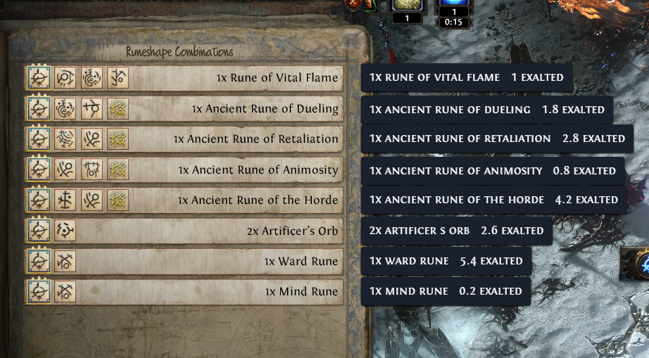

#  Exiled Exchange 2 (personal fork)

**This is a personal fork of [Kvan7/Exiled-Exchange-2](https://github.com/Kvan7/Exiled-Exchange-2),
customized for my own use** — notably an added Expedition Price Check widget
(see [EXPEDITION_CHECK.md](./EXPEDITION_CHECK.md)) that OCRs the Expedition
"Runeshape Combinations" reward panel via Windows' native OCR and shows a live
poe.ninja price next to each reward row, right in the game window:

| | |
| --- | --- |
|  |  |

It is not the official project and isn't published as a release. If you're
looking for the actual Exiled Exchange 2 app, go to the upstream link above.

Path of Exile 2 overlay program for price checking items, among many other loved features.

Fork of [Awakened PoE Trade](https://github.com/SnosMe/awakened-poe-trade).

The ONLY official download sites for upstream Exiled Exchange 2 are <https://kvan7.github.io/Exiled-Exchange-2/download> or <https://github.com/Kvan7/Exiled-Exchange-2/releases>, any other locations are not official and may be malicious. This fork isn't distributed anywhere - build it from source (see Development, below).

## Moving from POE1/Awakened PoE Trade

1. Download latest release from [releases](https://github.com/Kvan7/exiled-exchange-2/releases)
2. Run installer
3. Run Exiled Exchange 2
4. Launch PoE2 to generate correct files
5. Quit PoE2 and EE2 after seeing the banner popup that EE2 loaded
6. Copy `apt-data` from `%APPDATA%\awakened-poe-trade` to `%APPDATA%\exiled-exchange-2` to copy your previous settings
  - Resulting directory structure should look like this:
  - `%APPDATA%\exiled-exchange-2\apt-data\`
    - `config.json`
7. Edit `config.json` and change the value of "windowTitle": "Path of Exile" to instead be "Path of Exile 2", otherwise it will open only for poe1
8. Start Exiled Exchange 2 and PoE2

## FAQ

<https://kvan7.github.io/Exiled-Exchange-2/faq>

## Tool showcase

| Gem                                                | Rare                                                 | Unique                                                   | Currency                                                     |
| -------------------------------------------------- | ---------------------------------------------------- | -------------------------------------------------------- | ------------------------------------------------------------ |
|  |  |  |  |

### Development

Two parts, run in two separate shells (both need to stay running):

```shell
# Shell 1, from the repo root
cd renderer
npm install
npm run make-index-files
npm run dev
```

```shell
# Shell 2, from the repo root
cd main
npm install
npm run dev
```

The `main` process launches the actual Electron app window once it's built - the
`renderer` dev server needs to already be running first, since `main` loads the UI
from it (`http://localhost:5173`) rather than from built files in this mode. Editing
`renderer/` hot-reloads; editing `main/` rebuilds and restarts the Electron process
automatically (which resets any in-memory app state, e.g. unsaved widget config).

See [DEVELOPING.md](./DEVELOPING.md) for formatting, production builds, and releasing.

### Acknowledgments

- [awakened-poe-trade](https://github.com/SnosMe/awakened-poe-trade)
- [libuiohook](https://github.com/kwhat/libuiohook)
- [RePoE](https://github.com/brather1ng/RePoE)
- [poeprices.info](https://www.poeprices.info/)
- [poe.ninja](https://poe.ninja/)


