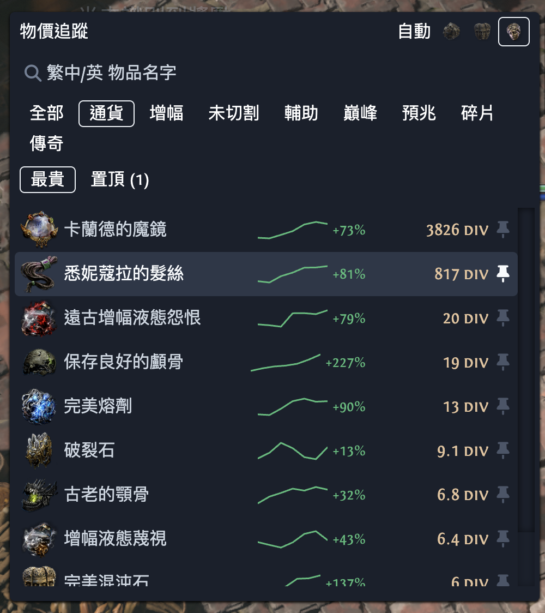
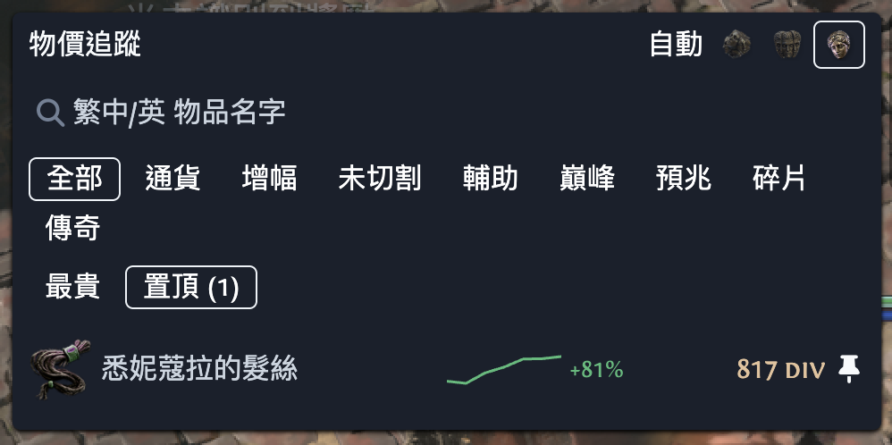
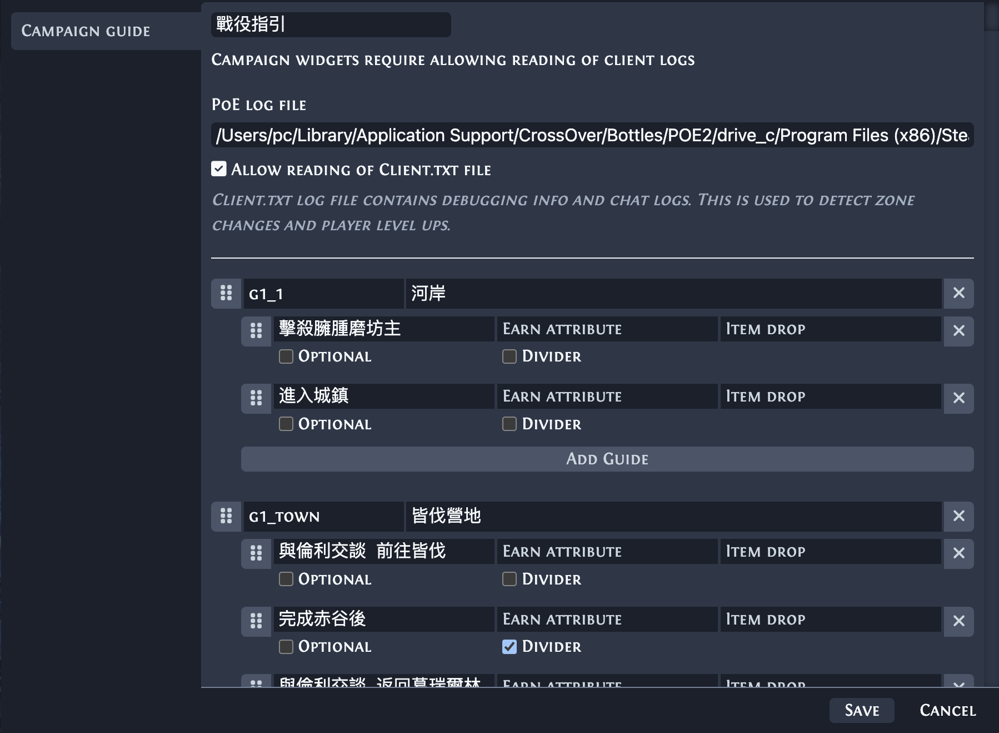
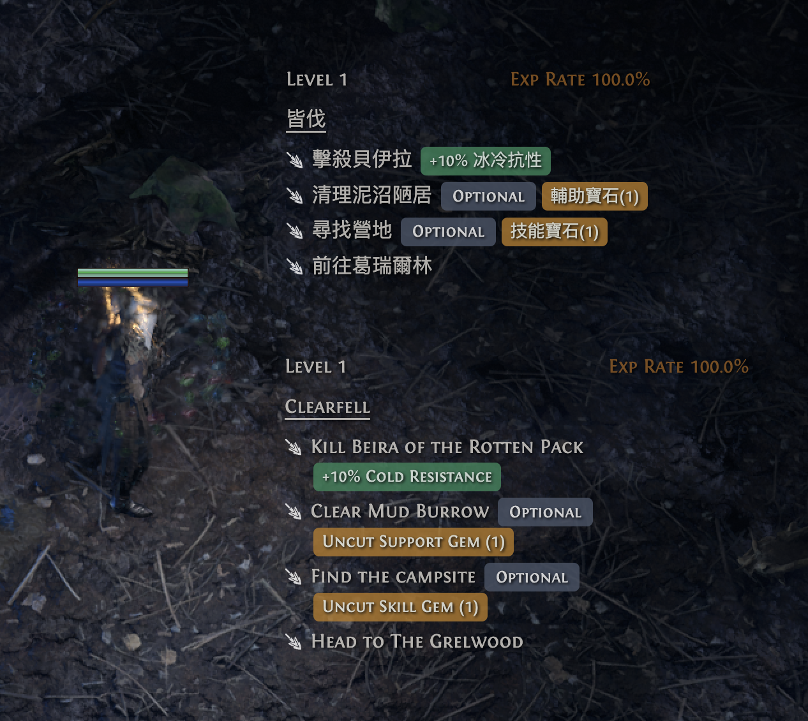
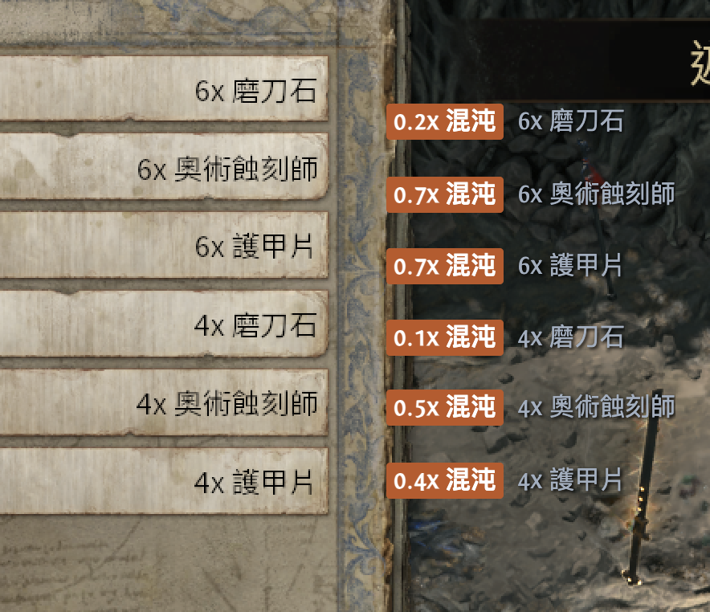
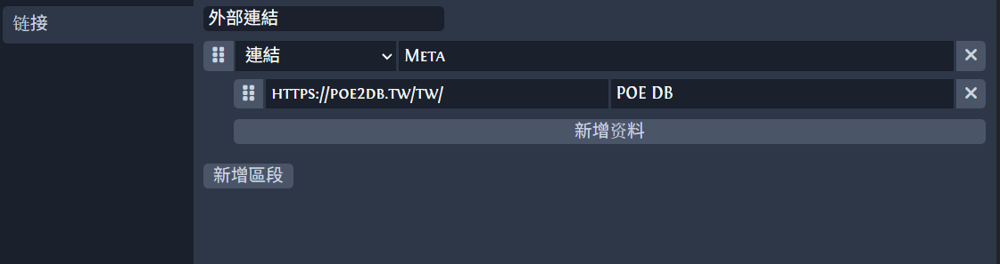
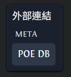

<b>For personal gaming currently.</b> Added widgets:
1. [Price track](#price-track-widget)
2. [Campaign guide](#campaign-guide-widget)
3. [Expedition Rune](#expedition-rune-widget)
4. [Url list](#url-list-widget)

[Build step](#build-step)

## Price Track Widget
A price track widget to show pricing. Data from poeninja, toggle exchange rate, search item, filter group, pinned item and spark chart.
| Top                                                               | Pinned                                                               |
|-----------------------------------------------------------------------|-----------------------------------------------------------------------|
|  |  |

## Campaign Guide Widget
Customisable campaign guide, default instructions only for zh-Hans + en.
| Setting                                                               | Display                                                               |
|-----------------------------------------------------------------------|-----------------------------------------------------------------------|
|  | |

## Expedition Rune Widget
Its modified from Endre's [fork](https://github.com/Endre-Tonnessen/Exiled-Exchange-2-Expedition-Checker) project, thanks to his implementation on Windows's OCR. Support zh-Hans translation in expedition widget.

1. mac port of OCR, using macOS native engine, currently set to ocr zh-Hans,en-US at the same time
2. modified win port of OCR to support zh-Hans, limitation on Windows OCR: only one language per call, no mixed zh+en pass, so the lang is pass from app language config

| Mac & Win                                                            | 
|------------------------------------------------------------------|
|  |

## Url List Widget
A url widget shortcut to access resources.

| Setting                                                          | Display                                                            |
|------------------------------------------------------------------|--------------------------------------------------------------------|
|  |  |

## Build Step
### Mac Build
1. to build dmg `sh testUpdate.sh`
2. grant accessibility + screen recording
    - remove the permission entries
    - re-sign `codesign --force --deep --sign - /Applications/Exiled\ Exchange\ 2.app`
    - kill the app and grant both
    - restart the app

### Win Build
1. install extra language OCR
    - open powershell with admin rights
    - `Add-WindowsCapability -Online -Name "Language.OCR~~~zh-TW~0.0.1.0"` and restart
    - configure ExiledExchange2 language, support zh-Hans,en-US mapping
2. to build exe
    - run build instruction from [DEVELOPING.md](./DEVELOPING.md#how-to-build)
    - open powershell with admin rights
    - cd to main/
    - `npx electron-builder --win --x64`

#  Exiled Exchange 2

Path of Exile 2 overlay program for price checking items, among many other loved features.

Fork of [Awakened PoE Trade](https://github.com/SnosMe/awakened-poe-trade).

The ONLY official download sites are <https://kvan7.github.io/Exiled-Exchange-2/download> or <https://github.com/Kvan7/Exiled-Exchange-2/releases>, any other locations are not official and may be malicious.

## Moving from POE1/Awakened PoE Trade

1. Download latest release from [releases](https://github.com/Kvan7/exiled-exchange-2/releases)
2. Run installer
3. Run Exiled Exchange 2
4. Launch PoE2 to generate correct files
5. Quit PoE2 and EE2 after seeing the banner popup that EE2 loaded
6. Copy `apt-data` from `%APPDATA%\awakened-poe-trade` to `%APPDATA%\exiled-exchange-2` to copy your previous settings
  - Resulting directory structure should look like this:
  - `%APPDATA%\exiled-exchange-2\apt-data\`
    - `config.json`
7. Edit `config.json` and change the value of "windowTitle": "Path of Exile" to instead be "Path of Exile 2", otherwise it will open only for poe1
8. Start Exiled Exchange 2 and PoE2

## FAQ

<https://kvan7.github.io/Exiled-Exchange-2/faq>

## Tool showcase

| Gem                                                | Rare                                                 | Unique                                                   | Currency                                                     |
| -------------------------------------------------- | ---------------------------------------------------- | -------------------------------------------------------- | ------------------------------------------------------------ |
|  |  |  |  |

### Development

See [DEVELOPING.md](./DEVELOPING.md)

### Acknowledgments

- [awakened-poe-trade](https://github.com/SnosMe/awakened-poe-trade)
- [libuiohook](https://github.com/kwhat/libuiohook)
- [RePoE](https://github.com/brather1ng/RePoE)
- [poeprices.info](https://www.poeprices.info/)
- [poe.ninja](https://poe.ninja/)

