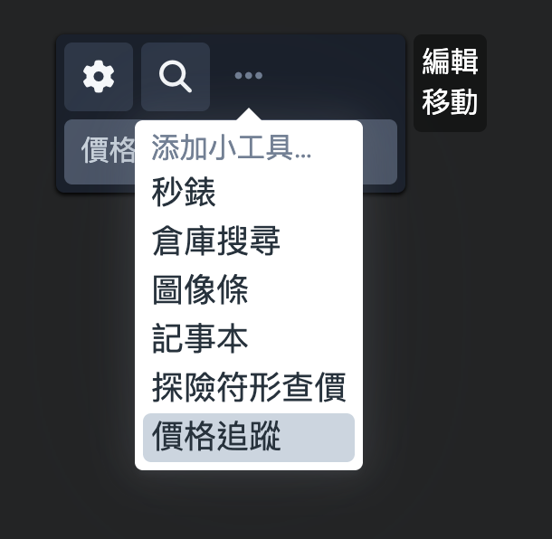
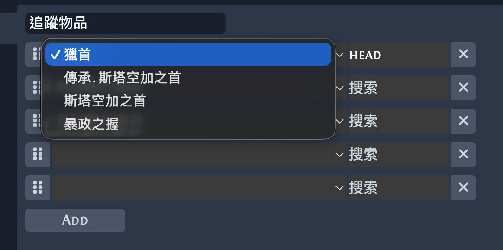
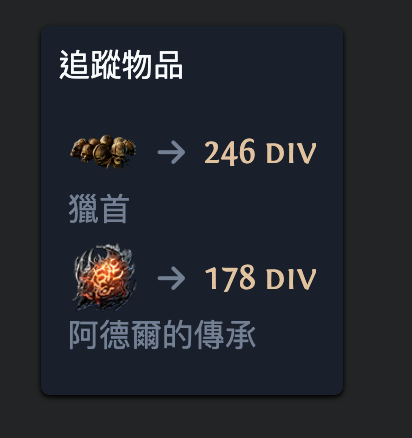
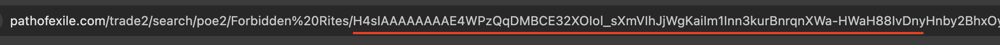
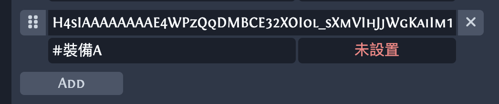
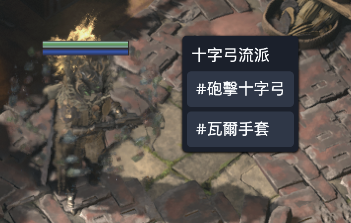
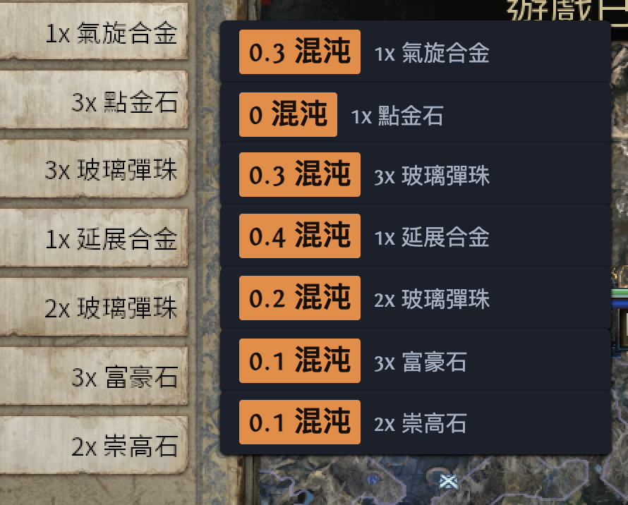
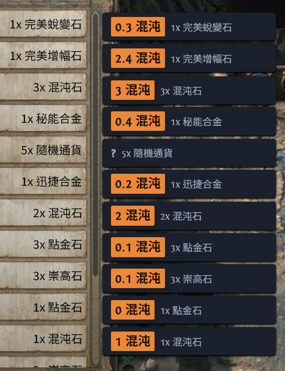
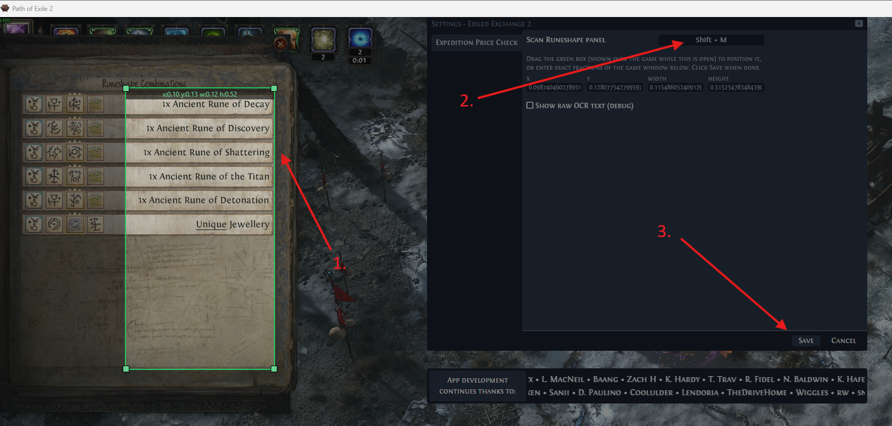

#  Exiled Exchange 2


<b>== THIS IS A FORK FOR MY OWN GAMING NEEDS ==</b> 

## 1. Price Track Widget
Create a new price track widget to always show price based on available currency data.

1. add price track widget

2. edit entry, the search input will filter each drop options, select to track it, filter support both translated text or key(english)

3. reuse vue component ItemQuickPrice to display pricing


## 2. Item Trade List
A simple modification on existing StashSearch widget
- add a new prefix logic to turn StashSearch button to open trade site based on name starts with #, become a hyperlink
- append current league.id as uri component
- entry without # is not affected

1. find trade filter codes

2. configure using stash search panel

3. build trade list


## 3. Expedition Price Check
Its modified from Endre's [fork](https://github.com/Endre-Tonnessen/Exiled-Exchange-2-Expedition-Checker) project, thanks to his implementation on Windows's OCR. Support zh-Hans translation in expedition widget.

### Mac Port
1. added mac port of OCR, using macOS native engine, currently set to ocr zh-Hans,en-US at the same time

2. to build dmg
  - `sh testUpdate.sh`
3. grant accessibility + screen recording
  - remove the permission entries
  - re-sign `codesign --force --deep --sign - /Applications/Exiled\ Exchange\ 2.app`
  - kill the app and grant both
  - restart the app

### Win Port
1. modified win port of OCR to support zh-Hans, limitation on Windows OCR: only one language per call, no mixed zh+en pass, so the lang is pass from app language config

2. install extra language OCR
  - open powershell with admin rights
  - `Add-WindowsCapability -Online -Name "Language.OCR~~~zh-TW~0.0.1.0"` and restart
  - configure ExiledExchange2 language, support zh-Hans,en-US mapping
3. to build exe
  - run build instruction from [DEVELOPING.md](./DEVELOPING.md#how-to-build)
  - open powershell with admin rights
  - cd to main/
  - `npx electron-builder --win --x64`

## *Below all from upstream
**This is a personal fork of [Kvan7/Exiled-Exchange-2](https://github.com/Kvan7/Exiled-Exchange-2),
customized for my own use** — notably an added Expedition Price Check widget
(see [EXPEDITION_CHECK.md](./EXPEDITION_CHECK.md)) that OCRs the Path of
Exile 2 Expedition "Runeshape Combinations" reward panel and shows a live
poe.ninja price next to each reward row, right in the game window:

Path of Exile 2 overlay program for price checking items, among many other loved features.
| | | |
| --- | --- | --- |
|  |  |  |

**Expedition Price Check is Windows-only** - it reads the panel via Windows'
own OCR engine (`Windows.Media.Ocr`), which has no equivalent on other
platforms. The rest of the app (everything from upstream Exiled Exchange 2)
remains cross-platform; only this one added feature is gated to Windows.

Path of Exile 2 overlay program for price checking items, among many other loved features - forked from [Awakened PoE Trade](https://github.com/SnosMe/awakened-poe-trade).

This fork isn't the official project or distributed anywhere - build it from source (see Development, below). For the actual Exiled Exchange 2 app, the only official sources are <https://kvan7.github.io/Exiled-Exchange-2/download> or <https://github.com/Kvan7/Exiled-Exchange-2/releases>; anywhere else may be malicious.

## Setting up Expedition Price Check

1. In the overlay's widget bar, open the **⋯** menu → **Add widget...** → **Expedition Price Check**.

   

2. Hover the new widget and click **Edit**.

   

3. Drag the green box over the reward text column of the "Runeshape Combinations"
   panel (the default position won't match your resolution/UI scale), confirm or
   change the hotkey (defaults to `Shift + M`), then click **Save**.

   

4. In-game, open a Runeshape Combinations panel and press the hotkey - a price should appear next to each recognized row.

### Expedition Price Check settings

All of the following live in the widget's own settings panel (**Edit**, per
step 2 above).

| Setting | Default | What it does |
| --- | --- | --- |
| Hotkey | `Shift + M` | Triggers a single scan of the calibrated region. |
| Region (drag the green box, or type exact x/y/width/height fractions) | calibrated per-user | The area that gets OCR'd on each scan - see step 3 above. |
| Color-code prices by rank | On | Colors each resolved price by how it ranks against the *other rows currently on screen* - highest is green, lowest is red, anything in between is yellow. This is relative to the current panel, not a fixed currency cutoff, so it keeps meaning the same thing as prices drift over a league. Example from the first screenshot above: rewards worth 4.2/4.4/8.4/1.2/12 exalted show 12 green, 1.2 red, and the other three yellow. A single resolved row (or every row tied at the same value) shows green. |
| Show full names (uncapped width) | On | Lets the widget grow wide enough to show the full recognized name instead of truncating it, so a misread is easy to spot. Turn off for a more compact widget once you trust the matches and don't need to see the name day-to-day. |
| Show raw OCR text (debug) | Off | Prints every unprocessed recognized line below the parsed rows - for diagnosing a new/changed panel layout or a matching problem without needing to instrument any code. |

<!-- ## Moving from POE1/Awakened PoE Trade

1. Download latest release from [releases](https://github.com/Kvan7/exiled-exchange-2/releases)
2. Run installer
3. Run Exiled Exchange 2
4. Launch PoE2 to generate correct files
5. Quit PoE2 and EE2 after seeing the banner popup that EE2 loaded
6. Copy `apt-data` from `%APPDATA%\awakened-poe-trade` to `%APPDATA%\exiled-exchange-2` to copy your previous settings
  - Resulting directory structure should look like this:
  - `%APPDATA%\exiled-exchange-2\apt-data\`
    - `config.json`
7. Edit `config.json` and change the value of "windowTitle": "Path of Exile" to instead be "Path of Exile 2", otherwise it will open only for poe1
8. Start Exiled Exchange 2 and PoE2 -->

## FAQ

<https://kvan7.github.io/Exiled-Exchange-2/faq>

## Tool showcase

| Gem                                                | Rare                                                 | Unique                                                   | Currency                                                     |
| -------------------------------------------------- | ---------------------------------------------------- | -------------------------------------------------------- | ------------------------------------------------------------ |
|  |  |  |  |

### Development

Two parts, run in two separate shells (both need to stay running):

```shell
# Shell 1, from the repo root
cd renderer
npm ci
npm run make-index-files
npm run dev
```

```shell
# Shell 2, from the repo root
cd main
npm ci
npm run dev
```

The `main` process launches the actual Electron app window once it's built - the
`renderer` dev server needs to already be running first, since `main` loads the UI
from it (`http://localhost:5173`) rather than from built files in this mode. Editing
`renderer/` hot-reloads; editing `main/` rebuilds and restarts the Electron process
automatically (which resets any in-memory app state, e.g. unsaved widget config).

See [DEVELOPING.md](./DEVELOPING.md) for formatting, production builds, and releasing.

### Installing dependencies safely

Use `npm ci`, not `npm install`, for routine setup - it installs exactly what
`package-lock.json` already resolved (same versions, same integrity hashes) and
errors out instead of silently re-resolving anything if the lockfile and
`package.json` disagree. Plain `npm install` can still pick up a newer version
within an existing `^`/`~` range in some cases; `npm ci` never does.

Given how often popular packages get compromised via a hijacked maintainer
account (a malicious version published under a trusted name, still semver-valid
so ordinary installs happily accept it), a few more habits are worth keeping:

- **Never run `npm update` or `npm install <pkg>@latest` casually.** Only bump a
  version deliberately, and review the full `package-lock.json` diff afterward -
  a small, intentional bump should produce a small diff; a huge, unexplained
  churn of unrelated transitive dependencies is worth stopping to look at before
  committing (this happened once already in this fork's history from a stray
  `npm install`, caught and reverted before it was committed).
- **Always commit `package-lock.json`, and read its diff like code.** It's the
  thing that actually pins what gets installed - treat an unexpected change to
  it with the same suspicion as an unexpected change to a source file.
- **Consider `--ignore-scripts`** (`npm ci --ignore-scripts`, or `ignore-scripts=true`
  in `.npmrc`) to block install-time lifecycle scripts, which is the actual
  mechanism most recent supply-chain payloads run through. Caveat: some
  dependencies legitimately need their install script to work at all - Electron
  itself downloads its platform binary via one, and native modules like
  `uiohook-napi` compile via one - so this isn't a safe blanket default here
  without testing that `main/` still installs correctly with it on.
- **`npm audit`** catches *known, already-reported* vulnerabilities in your
  current tree - useful, but reactive. It won't catch a malicious version in the
  window between publication and discovery, so it's a supplement to the habits
  above, not a replacement for them.

### Acknowledgments

- [awakened-poe-trade](https://github.com/SnosMe/awakened-poe-trade)
- [libuiohook](https://github.com/kwhat/libuiohook)
- [RePoE](https://github.com/brather1ng/RePoE)
- [poeprices.info](https://www.poeprices.info/)
- [poe.ninja](https://poe.ninja/)


